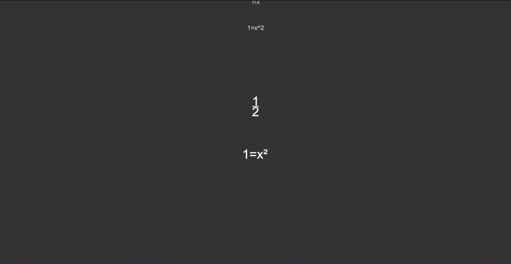

# MOcean

## Demo:

## Methamtics Ocean - a simple formula editor.

> [!WARNING]
> This project is in development, don't expect too much

# Featurs

- Powers
- Format on tab
- Cursor
- Cursor blink
- Fractions
- ~~Cursor movement~~
- ~~Roots~~

# Get started
Go to releases, download the archive and open it.

# How to use?
After you opened the program, start typing.

# Keys
- Tab - format
- ^ - power
- / Fraction with 1 character
- // Fraction with 2 or more characters